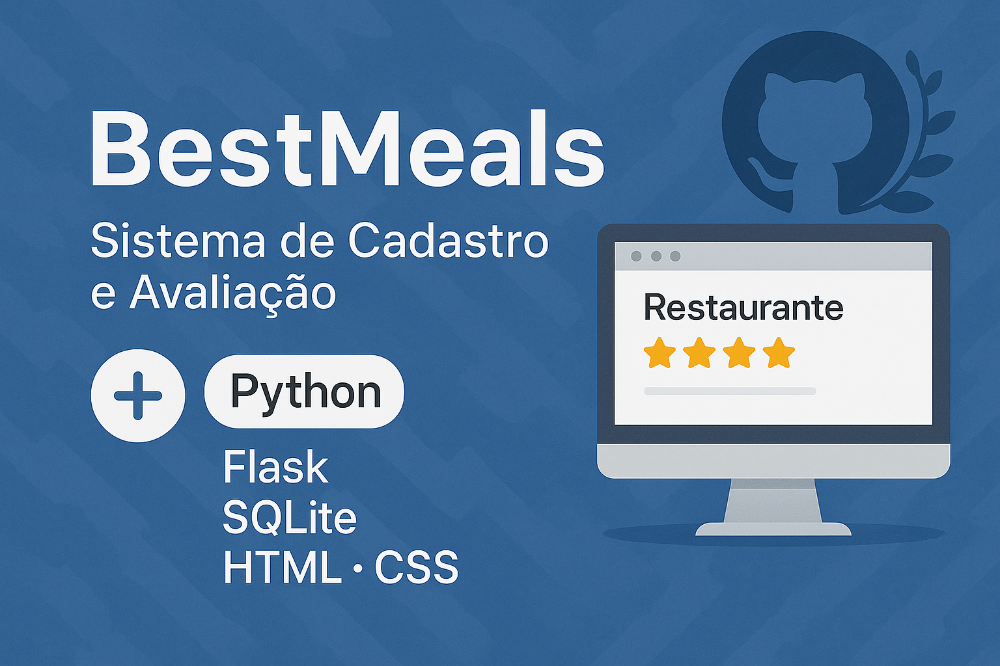
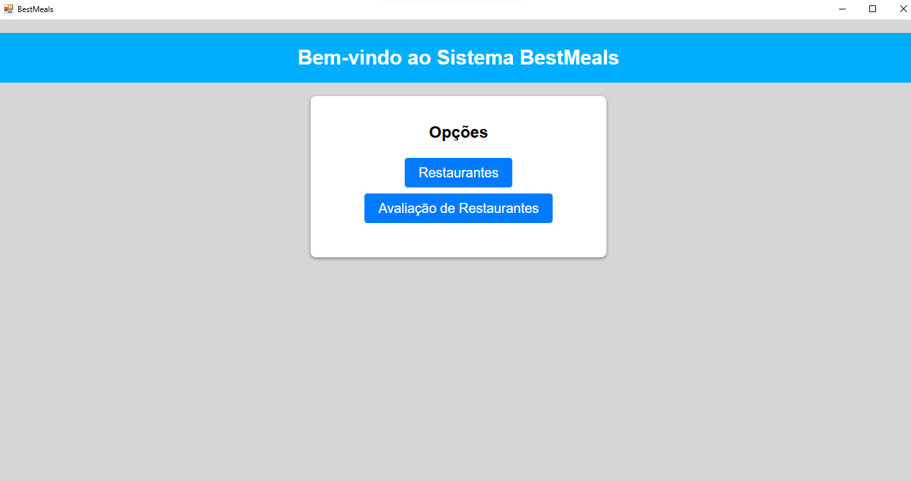
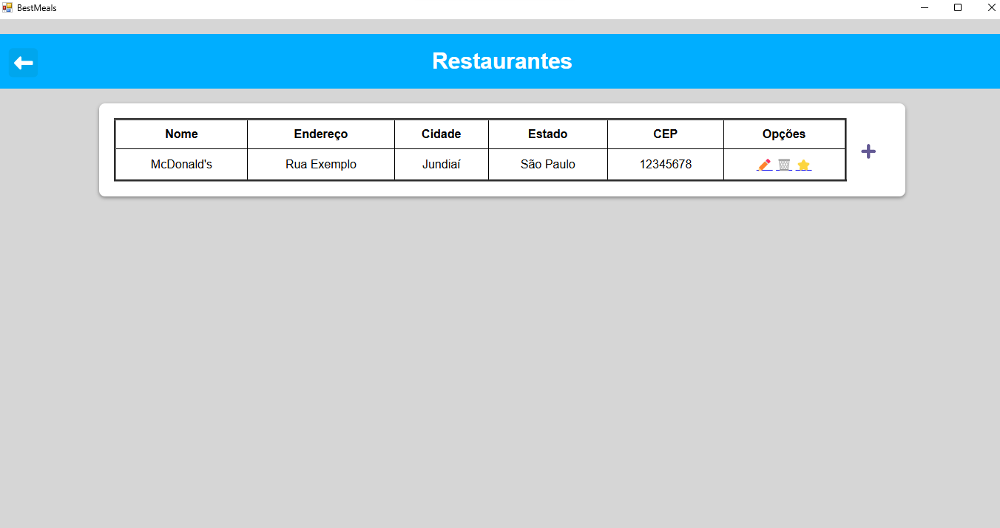
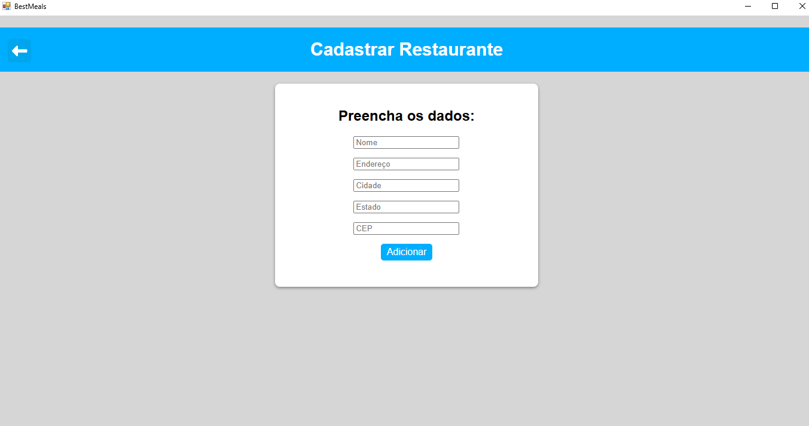
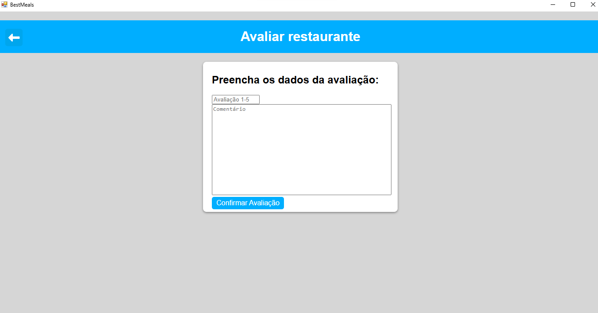
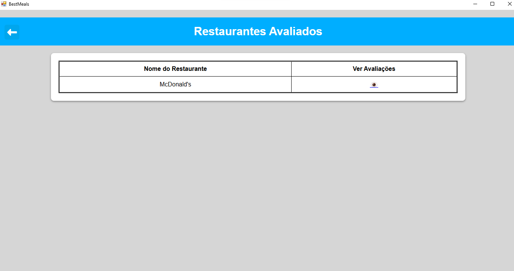
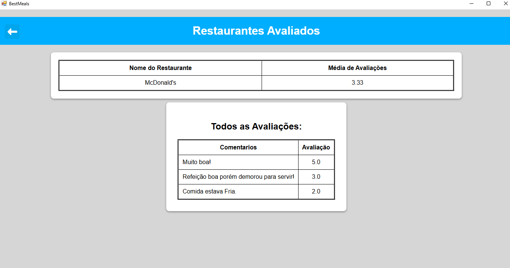

<h1> BestMeals </h1>

  

---

## 📚 Sumário
### [📌 Sobre o projeto](#sobre)
### [🧰 Tecnologias Utilizadas](#TecnologiasUtilizadas)
### [💻 Como rodar o programa (sem usar código)](#ComoRodarOPrograma)
### [👨‍💻 Como rodar o código (modo desenvolvedor)](#ComoRodarOProgramaSemCodigo)
### [📁 Estrutura de Pastas e Arquivos](#EstruturaDePastas)
### [📷 Imagens do sistema](#ImagensDoSistema)
### [📞 Contato e Créditos](#CreditosEContato)

---

## 📌 Sobre o projeto
### BestMeals é um sistema simples e funcional de cadastro e avaliação de itens. Foi idealizado inicialmente para restaurantes, mas sua estrutura permite fácil adaptação para avaliar qualquer coisa – como filmes, livros, produtos, entre outros.

### ⏱️ Este projeto foi desenvolvido em apenas uma semana, como parte de um processo seletivo para uma vaga de emprego na área de desenvolvimento.

### 💡 Objetivo principal: desenvolver um projeto prático que me permitisse demonstrar habilidades em programação e, ao mesmo tempo, aprender novas bibliotecas e funcionalidades, como o uso do Flask, SQLite e PyWebview.

### 🎯 O foco foi criar um sistema funcional, com boa organização de pastas e código limpo, que pudesse ser executado por qualquer pessoa, mesmo sem conhecimento técnico.

## 🧰 Tecnologias Utilizadas
 

Linguagem principal utilizada para desenvolver toda a lógica do sistema e integração entre as partes.

 

Framework web responsável por gerenciar as rotas e exibir as páginas HTML de forma dinâmica.

 

Banco de dados leve e local usado para armazenar os dados dos restaurantes e avaliações.

Biblioteca que permite executar a aplicação web como se fosse um programa de desktop, com uma janela nativa.

 
 

Estruturaram e estilizaram as interfaces gráficas das páginas do sistema. Foram utilizados vários arquivos CSS para manter o estilo organizado e separado por funcionalidade.

## 💻 Como rodar o programa (sem usar código)

#### ✅ 1. Baixe a pasta ["Arquivo Executável"](https://github.com/Rincon23/BestMeals/tree/main/Arquivo%20Execut%C3%A1vel)

#### ✅ 2. Execute o Arquivo "BestMeals"

    ├── Arquivo Executável <----------- BAIXE ESTA PASTA
        └── BestMeals.exe  <----------- EXECUTE ESTE ARQUIVO 

## 👨‍💻 Como rodar o código (modo desenvolvedor)

### ✅ 1º Passo (Instalar Python e bibliotecas):

### Instalar o Python em sua maquina

#### Baixe o Python em: https://www.python.org/

#### No terminal (CMD ou PowerShell):
    pip install Flask
---
    pip install pywebview

#### Se não funcionar, use:

    py -m pip install Flask
---
    py -m pip install pywebview

### ✅ 2º Passo — Instalar extensões no VS Code

#### No VS Code, instale:

- Python
- Python Debugger
- Pylance

### ✅ 3º Passo — Executar o projeto

#### No terminal do VS Code:
    python Flask\main.py

#### Esse comando executa o seguinte arquivo:

    ├── Arquivo Executável
    ├── Flask
    │    ├── BancoDeDados.py
    │    ├── Main.py <--------  ESTE ARQUIVO
    │    ├── Restaurante.py
    │    ├── RestauranteAvaliacao.py
    │    ├── static
    │    └── templates
    ├── Imagens
    ├── .gitignore
    └── README.md

## 📁 Estrutura de Pastas e Arquivos

### Abaixo está uma explicação da estrutura do projeto e da função de cada parte:

    ├── Arquivo Executável
    │   └── BestMeals.exe
    │       → Instalador do programa para rodar no Windows sem necessidade de abrir código.
    ├── Flask
    │   ├── BancoDeDados.py
    │       → Script responsável pela criação e manipulação do banco de dados SQLite.
    │   ├── Main.py
    │       → Arquivo principal que inicia o servidor Flask e o sistema.
    │   ├── Restaurante.py
    │       → Classe que representa os dados de um restaurante.
    │   ├── RestauranteAvaliacao.py
    │       → Classe que representa uma avaliação de restaurante.
    │   ├── static
    │   │   └── css
    │   │       → Arquivos CSS responsáveis pelo estilo visual das páginas.
    │   │       ├── Style-Restaurante-Avaliar.css
    │   │       ├── Style-Restaurante-Cadastrar.css
    │   │       ├── Style-Restaurante-Editar.css
    │   │       ├── Style-Restaurante-VerAvaliacoes.css
    │   │       └── Style.css (geral)
    │   └── templates
    │       → Páginas HTML renderizadas pelo Flask.
    │       ├── Menu.html
    │       ├── Restaurante-Avaliar.html
    │       ├── Restaurante-Cadastrar.html
    │       ├── Restaurante-Consultar.html
    │       ├── Restaurante-Editar.html
    │       ├── Restaurante-VerAvaliacoes.html
    │       └── Restaurantes.html
    │
    ├── Imagens
    |   → Imagens utilizadas na apresentação e documentação do projeto.
    │    ├── Avaliação
    │    ├── AvaliaçõesDoRestaurante
    │    ├── Cadastro
    │    ├── ImagemProjeto
    │    ├── Menu
    │    ├── TabelaComAvaliações
    │    └── TabelaRestaurantes
    │
    ├── .gitignore
    │   → Arquivo para ignorar arquivos e pastas no versionamento Git.
    │
    └── README.md
        → Arquivo de documentação do projeto (este aqui).

## 📷 Imagens do sistema

<table>
  <tr>
    <td align="center"><strong>Tela de Menu</strong></td>
    <td align="center"><strong>Tabela dos Restaurantes Cadastrados</strong></td>
  </tr>
  <tr>
    <td></td>
    <td></td>
  </tr>
  <tr>
    <td align="center"><strong>Tela de Cadastro dos Restaurantes</strong></td>
    <td align="center"><strong>Tela para Avaliar</strong></td>
  </tr>
  <tr>
    <td></td>
    <td></td>
  </tr>
  <tr>
    <td align="center"><strong>Ver Avaliações dos Restaurantes</strong></td>
    <td align="center"><strong>Tela de Avaliações</strong></td>
  </tr>
  <tr>
    <td></td>
    <td></td>
  </tr>
</table>

## 📞 Créditos e Contato

<h3> Desenvolvido por <a href= https://github.com/Rincon23>Enzo Rincon</a></h3> 

📍 Localização: São Paulo 

💼 Áreas de interesse: Desenvolvimento Web, Backend.

📢 Aberto a oportunidades profissionais na área de desenvolvimento

---

### 📬 Como entrar em contato?

Curtiu o projeto? Quer dar um feedback, trocar ideia sobre tecnologia ou até falar de vagas?

Tô sempre aberto a conversar! É só me chamar nos links aí embaixo 👇

### 📬 Como entrar em contato?

<table> 
    <tr>
        <td><strong>📧 E-mail:</strong></td> 
        <td><a href="mailto:enzorincon2003@gmail.com">enzorincon2003@gmail.com</a></td> 
    </tr>
    <tr> 
        <td><strong>💼 LinkedIn:</strong></td> 
        <td><a href="https://www.linkedin.com/in/enzorincon">linkedin.com/in/enzorincon</a></td> 
    </tr> 
    <tr> 
        <td><strong>📷 Instagram:</strong></td> 
        <td><a href="https://www.instagram.com/enzo.rincon">@enzo.rincon</a></td> 
    </tr> 
</table>

---

⭐ Obrigado por visitar este projeto! ⭐

